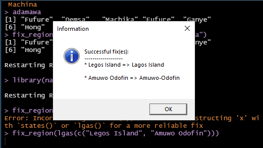
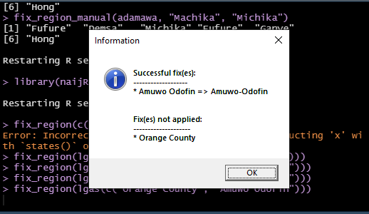
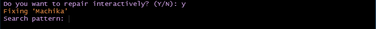
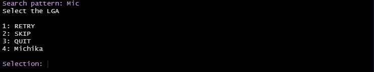
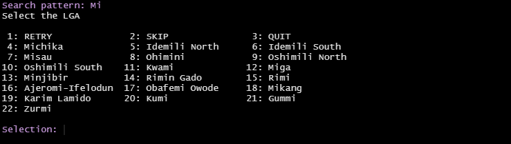

```{r, include = FALSE}
knitr::opts_chunk$set(
  collapse = TRUE,
  comment = "#>",
  results = 'hide'
)
```

## Motivation
Nigeria has 774 Local Government Areas (LGAs). There a number of factors that can make working with them particularly challenging:

1. Some LGAs share the same name with the State to which they belong to e.g. Bauchi LGA in Bauchi State and this can lead to wrong use of the data.
2. Some LGAs are in different States, but they bear the same name e.g. Obi LGAs in both Benue and Nasarawa States.
3. Common LGA spelling errors in the literature, even in official documents. 

## The solution
The function `fix_region` is designed to address spelling errors in sub-national administrative regions of Nigeria, with an emphasis on States and LGAs. 

### States
For the States this is quite straightforward; common minor mistakes can be corrected automatically by this function and since there are only 36 of them, they can otherwise be corrected via an inspection of the output of the function `states()`.

### LGAs
LGA spelling fixes are designed to occur in 3 incremental phases. If the user cannot effect the corrections at a particular level s/he can proceed to the next stage. The phases are as follows:

1. Automatic
2. Interactive
3. Manual

#### Automatic fix 
When the spelling error is slight and unambiguous, the function automatically effects the repair of the name. 

```{r, error = TRUE}
library(naijR)

fix_region("Legos Island")
```

When there is only a single misspelt LGA, and especially if it is supplied to the function as a plain string, the function will signal an error. The thinking is that for a single value that is probably provided interactively, an automated solution may not be necessary.

We will now add another LGA to the function:

```{r}
fix_region(c("Legos Island", "Amuwo-Odofin"))
```

On Windows machines and during an interactive R session, the function preferentially utilizes the native graphics interface for messaging and user interaction. The above line of code would appear like this:


Sometimes when we use a character vector to perform this check, the function `fix_region` may encounter difficulty deciding what fixes to apply. In such instances, the best thing to try first is to convert the vector into an `lgas` object. Note that `lgas()` will by default signal a warning when the vector we are supplying has misspelt strings, but if the function is nested in a function like `fix_region()`, this warning is suppressed. This is to reduce the tautology warnings even after fixes have been duly applied.

```{r, error = TRUE}
fix_region(c("Legos Island", "Amuwo Odofin"))
```


```{r, eval = FALSE}
fix_region(lgas(c("Legos Island", "Amuwo Odofin")))
```

This displays the following dialog:

<!--  -->

When the spelling mistakes depart very far from the function's partial matching capability, the user is told the fixes that could not be made. A possible solution lies in the next level of name repair.

```{r, eval = FALSE}
fix_region(lgas(c("Orange County", "Amuwo Odofin")))
```



#### Interactive fix
When the automatic fixes are not feasible, the user has the option of doing it interactively by calling `fix_region` and setting its `interactive` argument to `TRUE`. By following the prompts, the misspelt LGA as well as possible replacements are presented. All the user needs to do is to select the desired replacement value. This is particularly useful when the user is not sure of what the correct spelling might be.

When a misspelt LGA has more than one match, the interactive approach is the viable option for effecting fixes.

```{r, eval = 1}
adamawa <- c("Fufore", "Demsa", "Machika", "Fufure", "Ganye", "Hong")

# check for misspelt LGAs and, if necessary, attempt to fix
if (!all(is_lga(adamawa)))
  adamawa <- fix_region(adamawa)
```

```{r, include = FALSE}
if (!all(is_lga(adamawa)))
  adamawa <- suppressMessages(fix_region(adamawa))
```


We see that the purported LGA 'Machika' matches more than one LGA in the country. The original intent was to use "Michika". To address it, we run `fix_region` interactively. This method of the function is for class `lgas` so

```{r, eval=FALSE}
adamawa <- fix_region(lgas(adamawa), interactive = TRUE)
```




Next, the user is provided with a prompt to provide a search item for likely LGAs that would be an appropriate replacement for the misspelt one:


We now enter in the search term:



Upon clicking "OK", a list of possible matches comes up; in this instance, only one option is provided. The option 'RETRY' allows the user to reset the search term, 'SKIP' is to try out another misspelt item (where there are more than one) and 'QUIT' is to exit the interactive session.


When we broaden the search possibilities, more items are listed among the LGA candidates for the edit. In our example, we will provide *Mi* instead of *Mich*, so that more LGAs are matched:




```{r manual-fix, include=FALSE}
adamawa <- fix_region_manual(adamawa, "Machika", "Michika")
```

At the end of it all, the spellings are fixed.

```{r, results = 'markup'}
all(is_lga(adamawa))
```

#### Manual fixes
When spelling errors are identified and the correct one is known, then a manual fix can be applied. For this, we use the function `fix_region_manual` and its use is pretty straightforward:


```{r manual-fix, eval = FALSE}
```
