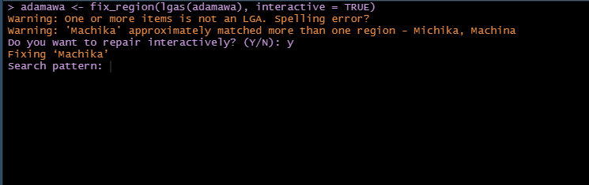
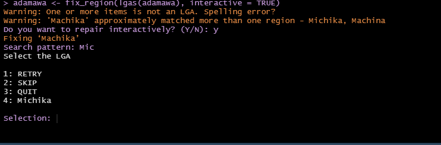
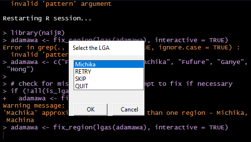
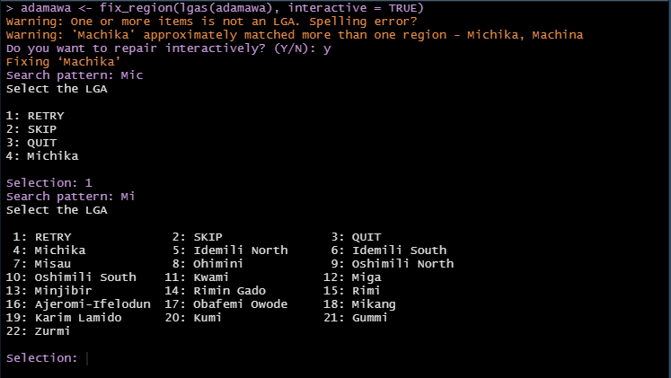
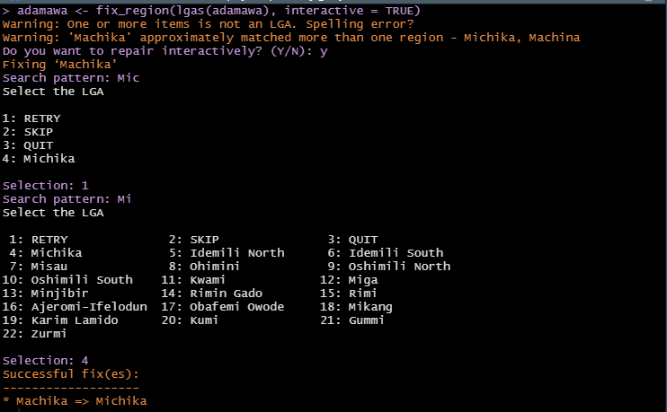

```{r, include = FALSE}
knitr::opts_chunk$set(
  collapse = TRUE,
  comment = "#>"
)
```

## Motivation
Nigeria has 774 Local Government Areas (LGAs). There a number of factors that can make working with them particularly challenging:

1. Some LGAs share the same name with the State to which they belong to e.g. Bauchi LGA in Bauchi State and this can lead to wrong use of the data.
2. Some LGAs are in different States, but they bear the same name e.g. Obi LGAs in both Benue and Nassarawa States.
3. Common LGA spelling errors in the literature, even in official documents. 

## The solution
The function `fix_region` is designed to address spelling errors in sub-national administrative regions of Nigeria, with an emphasis on States and LGAs. 

### States
For the States this is quite straightforward; common minor mistakes can be corrected automatically by this function and since there are only 36 of them, they can otherwise be corrected via an inspection of the output of the function `states()`.

### LGAs
LGA spelling fixes are designed to occur in 3 incrememtal phases. If the user cannot effect the corrections at a particular level s/he can proceed to the next stage. The phases are as follows:

1. Automatic fix
2. Interactive
<!-- 3. Manual -->

#### Automatic repair 
When the spelling error is slight and unambiguous, the function automatically effects the repair of the name. 

```{r, error = TRUE}
library(naijR)

fix_region("Legos Island")
```
When there is only a single misspelt LGA, and especially if it is supplied to the function as a plain string, the function will signal an error. The thinking is that for a single value that is probably provided interactively, an automated solution may not be necessary.

We will now add another LGA to the function:

‘
```{r}
fix_region(c("Legos Island", "Amuwo-Odofin"))
```

```{r, error = TRUE}
fix_region(c("Legos Island", "Amuwo Odofin"))
```

#### Interactive fixes
When the automatic fixes are not feasible, the user has the option of doing it interactively by calling `fix_region` and setting its `interactive` argument to `TRUE`. By following the prompts, the mispelt LGA as well as possible replacements are presented. All the user needs to do is to select the desired replacement value. This is particularly useful when the user is not sure of what the correct spelling might be.

When a misspelt LGA has more than one match, the interactive approach is the viable option for effecting fixes. 

```{r}
adamawa <- c("Fufore", "Demsa", "Machika", "Fufure", "Ganye", "Hong")
if (!all(is_lga(adamawa)))
  adamawa <- fix_region(adamawa)

```
We see that the purported LGA 'Machika' matches more than one LGA in the country. The original intent was to use "Michika". To address it, we run `fix_region` interactively. This method of the function is for class `lgas` so

```{r, eval=FALSE}
adamawa <- fix_region(lgas(adamawa), interactive = TRUE)
```












```{r}
all(is_lga(adamawa))
```

<!-- #### Manual fixes -->
<!-- When spelling errors are identified and the correct one is known, then a manual fix can be applied. In thi -->